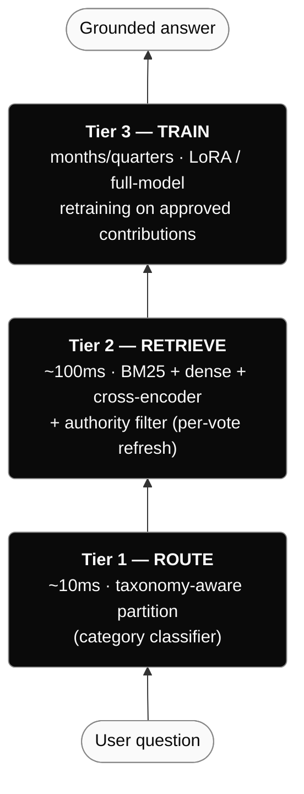
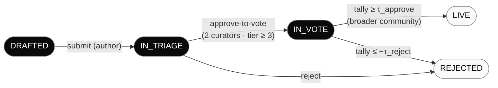

<!--
  Canonical source for the DeQuorum whitepaper.

  A second copy of the same prose lives at
    services/frontend/src/content/whitepaper.ts
  which the in-browser /whitepaper route renders. When editing the
  whitepaper, update BOTH files so the docs version and the web
  version stay in sync.
-->

# DeQuorum

### A crowdsourced, verifiable, contributor-owned foundational AI

**Whitepaper · v0.1 · June 2026**

---

## Abstract

DeQuorum is a foundational AI system designed from the ground up around a simple inversion of the current model: instead of a small handful of companies training AI on the world's knowledge and capturing the entire upside, **the people who contribute the knowledge, verify it, host the compute, and use the system all share in what it earns.**

The system is built in three layers. A **base language model** handles fluent reasoning. A **knowledge layer** of signed, peer-reviewed contributions grounds the model's answers in claims that real human contributors stand behind. Over time, the contribution layer's content gets distilled into the base model itself through low-rank fine-tuning, so what started as retrieval ends as a trained, contributor-owned model that competes head-to-head with closed alternatives on quality while remaining radically more transparent on attribution and economics.

Every claim in the system is cryptographically signed by its author. Every answer ships with a verifiable proof chain showing exactly which contributions shaped it. Every query that earns revenue distributes that revenue back to the contributors, reviewers, and infrastructure providers whose work produced the answer, denominated in real money.

This paper describes what DeQuorum is, why it's structured the way it is, and how it scales from today's seed prototype to a globally-relevant alternative to closed foundation models.

---

## 1. The problem

The current foundation-model market has three structural defects that compound:

**Closedness.** The largest models are trained by a small number of organizations on datasets the public cannot inspect. When such a model emits a claim, you have no principled way to ask "where did this come from?" — the lineage from training data to output token is a corporate asset, not a verifiable trail.

**Asymmetric capture.** The training data overwhelmingly comes from human-generated content: Wikipedia, Stack Overflow, scientific preprints, code repositories, public conversations, books. Almost none of the revenue these models generate flows back to those contributors. The value is extracted upstream — the data — and captured downstream — by the model operators.

**No accountability mechanism.** When a foundation model gets a factual claim wrong, the cost is paid by the user who acted on the wrong claim. There is no contributor whose reputation is on the line, no voting body that can mark a claim as obsolete, no review pipeline that can correct a class of errors at the source. The model is the source.

These three defects feed each other. Closedness makes accountability impossible, which makes asymmetric capture politically tolerable, which gives the operators the budget to keep training in private. DeQuorum exists because the alternative — open, accountable, and economically symmetric — is buildable.

---

## 2. The thesis

> **Foundation models don't have to be built and owned by a small number of corporations. The knowledge that goes into them already isn't.**

DeQuorum proposes that the right architecture for a publicly-useful AI looks like this:

- A **shared base model** anyone can run, swap, or fork.
- A **contribution pipeline** where any individual with verifiable domain knowledge can submit signed claims, and where the network's voting body — not a corporate trust-and-safety team — decides which claims get to ground the model's answers.
- A **revenue distribution layer** that follows attribution end-to-end: when a query earns revenue, the contributors whose facts shaped the answer, the reviewers who triaged them, and the compute hosts who served them all receive a calculated share.
- A **training feedback loop** that, over time, distills the contribution corpus directly into the model's weights via low-rank fine-tuning, so the network's knowledge ceases to be a retrieval-time augmentation and becomes the model itself.

The result is a system of accountability for the production of intelligence.

---

## 3. The architecture

### 3.1 The three-tier model

At inference time, a question travels through three concentric tiers, each fast-to-slow and broad-to-narrow:

**Routing** picks which domain (or domains) the question concerns. A taxonomy of categories — the same taxonomy contributions are filed under — collapses the search space by 100×–1000×. A medical question never reaches the legal partition; a Python question never reaches the macroeconomics partition.

**Retrieval** finds the relevant contributions within the routed partition. The system combines three complementary signals:

1. *Sparse* (BM25) retrieval, which catches exact-keyword matches that embeddings miss: entity names, identifiers, numbers, version strings.
2. *Dense* (vector ANN) retrieval, which catches paraphrase and conceptual similarity.
3. *Cross-encoder* reranking, which reads the question and each candidate passage *together* and scores how well one actually answers the other.

A final filter applies governance: only `LIVE` contributions surface, weighted by tally and contributor tier.

**Training** is the long game. As a category accumulates ~10,000 approved contributions, the network trains a domain-specific low-rank adapter (LoRA) on the `(question-like, contribution)` pairs. The adapter encodes that knowledge into the model's weights. Retrieval falls back to "contributions added since the last training cycle" — a much smaller set. Multiple adapters can be composed at inference time for cross-domain questions.

The architectural bet is that **the system that wins long-term is the one that learns from its contribution corpus, not just retrieves over it.** Retrieval is the way the network operates before it has earned the right to train. The training tier is the long-term moat — a moat the existing closed players cannot reach, because they do not own a verifiable contribution pipeline.

### 3.2 The contribution as the atomic unit

The atomic unit of value in DeQuorum is the **contribution**: a signed factual claim, attributed to a contributor and filed under a category in the curated taxonomy. Every contribution carries:

- **The claim itself** — natural-language text, with optional citations to external sources.
- **A cryptographic signature** — Ed25519 over the canonical bytes of the claim's contents. Anyone can verify, at any later time, that this exact text was authored by the holder of this exact key.
- **Lineage metadata** — version number, parent version, and a stable lineage identifier that survives edits. The history of a claim is reconstructible from any point.
- **Categorization** — which taxonomy node it belongs to.
- **A governance status** — see §4.

Once `LIVE`, a contribution is eligible to appear in any answer the network produces in its category. When it appears, the proof chain attached to the answer records *which* contributions grounded it, signed end-to-end so a downstream consumer can verify the attribution without trusting the operator.

### 3.3 Layering over a swappable base model

DeQuorum is not tied to any one base model. The system ships a **registry** of license-pure base models (Apache-2.0, MIT, Llama 3 Community License — the openness rule is encoded in the registry contract). Operators select which model the network is currently running. A documented model-swap procedure ensures any swap is one constant change away, with the same retrieval pipeline working unchanged on top.

This matters for two reasons. First, the open-model landscape is moving fast, and a network designed around a specific model would freeze its own ceiling at that model's release date. Second, the long-term distillation path (§3.5) needs to *replace* the base model with a contributor-trained one. A network that can't swap its model also can't take ownership of it.

### 3.4 Mathematical formalism

The three tiers each admit a short formal statement. The notation isn't load-bearing for the system — the implementations could swap algorithms within each tier — but writing it down makes the *boundary* between tiers explicit and the *failure modes* identifiable.

**Tier 1 — routing.** Let $\mathcal{C}$ be the set of taxonomy categories and let $\mathcal{E}_c \subseteq \mathcal{E}$ be the curated personas attached to category $c$. Given a query $q$, the routing layer computes

$$
\hat{c} = \mathop{\mathrm{argmax}}_{c \in \mathcal{C}} \; s_R(q, c)
$$

where $s_R$ is a routing score. In the current implementation $s_R$ is cosine similarity between a sentence-transformer embedding of $q$ and the centroid embedding of $c$'s category prompts. Routing is accepted iff $s_R(q, \hat{c}) \geq \tau_R$ for a threshold $\tau_R$ (currently $0.30$); otherwise the system falls through to the base assistant.

Because $|\mathcal{C}|$ is constant in the corpus size and retrieval (Tier 2) only ever runs on contributions filed under $\hat{c}$, routing collapses the per-query search space by a factor of $|\mathcal{D}| / |\mathcal{D}_{\hat{c}}|$, where $\mathcal{D}$ is the full contribution corpus and $\mathcal{D}_c$ is its partition under category $c$. For a uniform taxonomy this equals the partition factor $|\mathcal{C}|$; for the power-law taxonomies real-world domains produce, the factor is larger in the head and smaller in the tail.

**Tier 2 — retrieval.** Within partition $\mathcal{D}_{\hat{c}}$, the system computes two scores per candidate contribution $d$:

$$
s_{\text{sparse}}(q, d) = \text{BM25}(q, d), \qquad s_{\text{dense}}(q, d) = \frac{\langle \phi(q), \phi(d) \rangle}{\|\phi(q)\| \, \|\phi(d)\|}
$$

where $\phi$ is the sentence embedder. The fused score combines them via Reciprocal Rank Fusion:

$$
s_{\text{fused}}(q, d) = \frac{1}{k + r_{\text{sparse}}(d)} + \frac{1}{k + r_{\text{dense}}(d)}
$$

with $k = 60$ a smoothing constant and $r_*(d)$ the rank of $d$ under each scorer. The top-50 by $s_{\text{fused}}$ then pass through a cross-encoder reranker $g(q, d) \in \mathbb{R}$ that reads $(q, d)$ jointly, producing the final top-$K$ retrieval set $R_K(q)$.

An authority filter applies governance: $R_K(q)$ is restricted to contributions with `status = LIVE`, `version = current`, $\text{tally}(d) \geq \tau_T$, and $\text{tier}(\text{author}(d)) \geq \tau_A$. The augmented prompt sent to the base model is then

$$
\text{prompt}(q) = \text{persona}(\hat{c}) \;\|\; \text{format}\bigl(R_K(q)\bigr) \;\|\; q
$$

where $\|$ denotes concatenation. The base model's generation conditions on this concatenation; the proof chain (§4.2) records the elements of $R_K(q)$ as the contributions that grounded the answer.

**Tier 3 — training.** Given a corpus $\mathcal{D}_c^{\text{live}}$ of approved contributions in category $c$, the system constructs training pairs $(q_i, a_i)_{i=1}^N$ by (a) sampling existing query–answer logs whose retrieval intersected $\mathcal{D}_c^{\text{live}}$, and (b) synthesizing question-like prompts from each $d \in \mathcal{D}_c^{\text{live}}$ via a templated inverse. A LoRA adapter is then fine-tuned on the base model $M$.

LoRA replaces a weight matrix $W \in \mathbb{R}^{m \times n}$ in $M$ with $W + BA$, where $B \in \mathbb{R}^{m \times r}$ and $A \in \mathbb{R}^{r \times n}$ are learned and $r \ll \min(m, n)$. The total trainable parameter count is $r(m + n)$ instead of $mn$ — typically a 100–1000× reduction. Multiple adapters $\{B_c A_c\}_{c}$ trained on different categories can be composed at inference time:

$$
W' = W + \sum_{c \in \mathcal{A}} \alpha_c B_c A_c
$$

for active-adapter set $\mathcal{A}$ and per-adapter scaling $\alpha_c$.

A retrieval-to-training transition is justified for category $c$ once $|\mathcal{D}_c^{\text{live}}|$ exceeds an empirical threshold (≈ $10^4$ in our current estimate). After the transition, retrieval inside the partition continues to serve "fresh contributions added since the last training cycle" — a much smaller, lower-latency set.

**Proof-chain integrity.** Every signed entity (contribution, vote, comment, triage verdict) carries a signature $\sigma_e = \mathrm{Sign}_{k}\bigl(H(\mathrm{payload}_e)\bigr)$ over the canonical bytes of its payload, where $k$ is the actor's Ed25519 signing key and $H$ is BLAKE2b. The proof chain attached to an answer is the ordered list

$$
\Pi(a) = \bigl[\sigma_{d_1}, \sigma_{d_2}, \dots, \sigma_{d_K}, \sigma_{a}\bigr]
$$

where $d_1, \dots, d_K \in R_K(q)$ and $\sigma_a$ is the operator's signature over the produced answer. Verification of $\Pi(a)$ requires only the public keys of the contributors and the operator — no trust in the storage layer. The ledger payout computation (§5) iterates exactly over $\Pi(a)$, so the same data structure that lets an end user audit an answer also drives revenue distribution.

**Tier-weighted voting.** Let $V(d) = \{v_1, \dots, v_n\}$ be the votes cast on contribution $d$, each $v_i \in \{-1, 0, +1\}$ submitted by contributor $u_i$ at tier $t_i$. The effective tally is

$$
T(d) = \sum_{i=1}^n w(t_i) \cdot v_i, \qquad w: \mathrm{Tier} \to \mathbb{R}_{\geq 0}
$$

with $w$ the tier-weight map of §4.1. Promotion to `LIVE` requires $T(d) \geq \tau_{\text{approve}}$; rejection requires $T(d) \leq -\tau_{\text{reject}}$; veto is implemented as an extra term in $w$ that is *only* applied during the triage stage. Decoupling triage-weight from vote-weight is the formal expression of the "curators unblock; community decides" rule.

### 3.5 From retrieval to training

Once the contribution pipeline produces enough high-consensus content in a domain — empirically, on the order of $10^4$ approved claims — the next step is to fine-tune. A LoRA adapter is small (a few percent of the base model's parameters), cheap to train (single-GPU-hours), and composable: multiple adapters stack at inference time, so a question that spans medicine and law can light up both adapters at once.

This is where DeQuorum diverges from every existing RAG product. RAG-as-a-feature is a retrieval-time augmentation: the model knows nothing, and the augmentation tells it. RAG-as-a-foundation, plus a contribution pipeline, plus distillation, becomes a *trained model* that the network owns. The retrieval layer never goes away — it serves fresh contributions until the next training cycle — but the model itself starts carrying the network's knowledge.

The contribution corpus, the trained adapters, and the proof chains tying them to specific contributors stay in the open. No competitor with a closed pipeline can reach the same place, because none of them owns a contribution network.

---

## 4. Governance: how contributions become law

A contribution is just text until the network has decided whether to trust it. DeQuorum runs every contribution through a four-stage lifecycle, with a different group of participants holding power at each stage and a different accountability mechanism at each transition.

1. **Submit.** Anyone with a verified identity and an active agreement can submit. The contribution carries the contributor's signature.
2. **Triage.** Reviewers with sufficient tier read, discuss, and request edits in a comment-thread interface that mirrors a code-review tool. They vote *approve-to-vote*, *reject*, or *abstain*. Two approvals with no curator veto move the contribution to the next stage.
3. **Vote.** The broader community — a wider pool of tier-1+ voters — assesses whether the triaged contribution actually deserves to ground answers. Vote weight is tier-weighted (per §4.1). A threshold tally promotes to `LIVE`; a threshold negative tally rejects.
4. **Live.** Eligible to appear in any answer. Stays live until a newer version supersedes it.

Three side flows attach:

- **Comments** (Phase 1, shipped) thread under every contribution. Triage rationale, review discussion, post-acceptance clarifications all use the same model.
- **Edit requests** (Phase 3, planned) are PR-style proposed changes. A reviewer drafts a new version of the contribution and submits it as a suggestion. The original author accepts (creating a new lineage version with attribution preserved) or declines.
- **Public activity feed** (Phase 4, planned) surfaces what's being submitted, triaged, voted, and accepted across the network, building external credibility and giving non-contributing users something to read while the agent is the main draw.

### 4.1 Tier-weighted voting

A static one-vote-one-account model is sybil-vulnerable. DeQuorum solves this with a tier ladder:

| Tier | Name | How earned | Vote weight | Submission cap |
| --- | --- | --- | --- | --- |
| 0 | Anonymous | default for new accounts | 0 (recorded, not counted) | 0 |
| 1 | Email Verified | verified email address | 0 (recorded, not counted) | 5/day |
| 2 | Social Proof | verifiable social handle | 1.0 | 50/day |
| 3 | Credentialed / Reputation | W3C VC OR sustained consensus history | 2.5 | 500/day |
| 4 | Curator | elected by the community | 1.0, but *veto power* in triage | 10,000/day |

The asymmetry is intentional. **Curators wield veto in triage but have *less* weight in the community vote.** The function of a curator is to keep the queue *moving* — to reject obvious noise, request edits, unblock discussion. The function of the community vote is to keep the network *correct*. Conflating those roles into a single weighting collapses the system into oligarchy or into noise.

### 4.2 Every signature, recorded forever

The proof chain is not a UI nicety. The same `Signature` primitive that signs contributions also signs comments, votes, triage verdicts, and edit requests. Every state transition has a record of who triggered it, and that record is cryptographically tied to the actor's keypair. The result is a system where the question "who decided this contribution gets to ground answers?" has a verifiable, auditable answer.

This matters at three different scales:

- **Per-query**: an end user reading an answer can demand to see the chain that produced it.
- **Per-contribution**: an external auditor can trace a contribution from submission through triage through vote to its current `LIVE` status, with every reviewer's signature.
- **Per-distillation**: when a contribution makes it into a LoRA adapter or a full retraining cycle, the cryptographic lineage from contributor to model weight is preserved in the network's ledger.

---

## 5. Economics: the kickback model

DeQuorum's economic premise is straightforward: **revenue flows to the participants whose work produced the value.**

When a query against the network earns money — through subscription, per-query billing, or aggregate sponsorship — that revenue is split according to a transparent ledger:

| Recipient | What earns them a share | Why |
| --- | --- | --- |
| **Contributor** | their contributions grounded the answer | the knowledge layer is what makes the answer trustworthy |
| **Reviewer** | their triage and votes moved the relevant contributions to `LIVE` | review is itself unpaid work in every comparable system; DeQuorum pays it |
| **Compute host** | their hardware served the inference | running models costs real money and must be sustainable for non-corporate operators |
| **Network operator** | infrastructure beyond compute (storage, identity, payments, governance tooling) | the connective tissue has real costs |
| **Treasury** | research, dispute resolution, infrastructure reserves | the network needs a slow-money pool for things no individual share can fund |

The exact split is governance-tunable. The principle is fixed: **every role that contributed to the answer is named on the ledger.** Payouts use conventional rails (Stripe ACH at modest scale; the protocol is payment-rail-agnostic). A contributor whose contribution is cited in 100,000 queries receives a real, calculated payout — not a "thanks for your contribution" badge.

The kickback model is not an afterthought to the architecture. It is *why* the architecture is structured the way it is. The cryptographic signatures, the proof chain, the lineage tracking — all of these are load-bearing for revenue distribution. The audit trail that an end user uses to verify an answer is the same audit trail that the ledger uses to compute payouts. There is no separate "monetization layer" because the entire system is the monetization layer.

---

## 6. Open foundations

DeQuorum is open source under Apache 2.0, and the production stack is intentionally open-license top to bottom. This is a load-bearing design choice, not a stylistic one: a system whose claim to legitimacy is *contributor accountability* cannot itself rest on an opaque substrate. Every component below was selected so that anyone who wants to verify, fork, or operate a DeQuorum instance can do so without asking permission of a closed vendor.

| Layer | Component | License |
| --- | --- | --- |
| Base LLMs | Qwen 2.5 (default), Mistral 7B, Phi-4, Granite 3.1, Llama 3 family | Apache 2.0 / MIT / Llama 3 Community License (gated by the registry's openness rule) |
| Inference server | [Ollama](https://ollama.com/) | MIT |
| App / API | [FastAPI](https://fastapi.tiangolo.com/), [uvicorn](https://www.uvicorn.org/), [psycopg 3](https://www.psycopg.org/), [SQLAlchemy](https://www.sqlalchemy.org/), [Alembic](https://alembic.sqlalchemy.org/) | MIT / BSD |
| Retrieval | [sentence-transformers](https://www.sbert.net/), [Hugging Face Transformers](https://huggingface.co/docs/transformers) | Apache 2.0 |
| Database | [PostgreSQL 16](https://www.postgresql.org/) | PostgreSQL License (BSD-style) |
| Frontend | [React](https://react.dev/), [Vite](https://vitejs.dev/), [TanStack Router / Query](https://tanstack.com/), [Tailwind](https://tailwindcss.com/) | MIT |
| Proxy | [Caddy](https://caddyserver.com/) | Apache 2.0 |

The base-model registry encodes the openness rule directly. A profile cannot be the default unless its license is in the `OPEN_LICENSES` set. This rule applies to every swap, every adapter, every successor model — there is no path by which DeQuorum's serving substrate becomes proprietary by accident.

**The one exception** is Firebase Auth, used today as the credential surface because solving email + social signin is not the problem this project sets out to solve. It is wrapped behind a small `dequorum.auth` module so that swapping to an open identity provider (Supabase Auth, Ory Kratos, Auth.js, or self-hosted) is a one-file change. Making that swap before any external launch is on the v0.2 milestone list — the goal state is zero closed dependencies in the critical path.

The openness commitment extends to the network's outputs as well: the contribution corpus, the proof chains, the trained LoRA adapters, and the per-query attribution records all stay in the open. The network's value compounds *because* its inputs and outputs are inspectable. A closed contribution pipeline would invalidate the accountability claim that distinguishes DeQuorum from the closed alternatives it argues against.

---

## 7. Why this is novel

A comparison against the most-cited adjacent systems makes the differentiation concrete:

| System | Open weights? | Contribution pipeline? | Verifiable attribution? | Revenue to contributors? |
| --- | --- | --- | --- | --- |
| OpenAI / Anthropic | No | No | No | No |
| Llama (Meta) | Yes | No | No | No |
| Wikipedia | (no AI) | Yes | Per-edit, not per-claim | No |
| Stack Overflow | (no AI) | Yes | Yes | No (data was sold to AI companies; contributors paid nothing) |
| HuggingFace | Yes (model hosting) | No | No | No |
| Perplexity / You.com | No (model) | No | Inline web citations | No |
| **DeQuorum** | **Yes** | **Yes** | **Per-claim, signed, lineaged** | **Yes** |

DeQuorum is not the first system to do any of these things in isolation. It is, to our knowledge, **the first to combine all four into a single end-to-end system**, where each property reinforces the others — open weights enable independent verification; the contribution pipeline produces the data the weights will eventually train on; verifiable attribution makes payouts computable; payouts incentivize the contribution pipeline.

The closest comparable in spirit is Wikipedia, but Wikipedia famously has no economic mechanism, no AI integration, and no architecture for distilling its content into a model the contributors own. The closest comparable in technology is Perplexity, but Perplexity has no contribution pipeline — it cites web pages, not contributors, and the web pages were not written for Perplexity. DeQuorum is what happens when those two threads — the contributor commons and the AI inference layer — are designed together, from scratch, with the economic mechanism load-bearing in the architecture.

---

## 8. Experimental validation

The architectural claims of §3 are testable. This section reports results from the v0.1 benchmark harness, with three intentionally separated buckets and three intentionally separated conditions. Reading order: experimental design first, then results per claim, then an honest accounting of limits.

### 8.1 Experimental design

Two benchmark surfaces are reported, because the cost profile is very different:

- **Routing-only** (fast — N=127). Tests just the routing layer: does the system pick a qualified category? Doesn't generate answers, so it doesn't pay Ollama latency. Scales to hundreds of questions in seconds. Reproducible with `dequorum routebench`; full report in [docs/benchmarks/routebench.md](benchmarks/routebench.md).
- **Full-pipeline** (slow — N=15). Vanilla vs DeQuorum-full vs DeQuorum-no-retrieval, with real model generation. Bound by Ollama latency at ~30–60 seconds per query × 3 conditions, so the practical N is small. Side-by-side answers in [docs/benchmarks/qwen-bench.md](benchmarks/qwen-bench.md).

**Buckets.** Question pool composition for the routing-only benchmark:

| Bucket | N | Source | Tests |
| --- | ---: | --- | --- |
| `seeded` | 5 | Hand-curated, matches existing contributions | Lift over base model when grounding exists |
| `seeded_generated` | 60 | Template-filled from category specialty tags (12 per category × 5 categories) | Routing scales beyond hand-curated questions |
| `unseeded` | 5 | In-domain, no specific contribution | Graceful degradation to persona-only |
| `out_of_domain` | 5 | Hand-curated topics no category covers | Refusal vs hallucination |
| `ood_mmlu_like` | 42 | MMLU-shaped questions across 42 OOD subjects (anatomy, law, history, …) | Refusal at scale across hard-science/social-science/humanities |
| `ood_truthfulqa_like` | 10 | TruthfulQA-shaped questions where vanilla models commonly hallucinate | Refusal on tricky factual claims |

Full-pipeline benchmark uses the 15 hand-curated questions (5 per `seeded` / `unseeded` / `out_of_domain` bucket).

**Conditions** (full-pipeline only; routing-only collapses to one):

- **A. Vanilla.** Bare base model, generic system prompt. No DeQuorum at all.
- **B. DeQuorum full.** Route → retrieve → augmented category prompt → signed proof chain.
- **C. DeQuorum no-retrieval.** Router + category persona only; retrieval is skipped. This isolates the contribution of the *retrieval* layer (B vs C) from the contribution of the *routing/persona* layer (C vs A).

**Conditions** (each question is run three ways for an apples-to-apples comparison):

- **A. Vanilla.** Bare base model, generic system prompt. No DeQuorum at all.
- **B. DeQuorum full.** Route → retrieve → augmented category prompt → signed proof chain.
- **C. DeQuorum no-retrieval.** Router + category persona only; retrieval is skipped. This isolates the contribution of the *retrieval* layer (B vs C) from the contribution of the *routing/persona* layer (C vs A).

**Setup.** Base model: Qwen 2.5 Coder 7B (Apache-2.0) via Ollama. Router: embedding-based, $\tau_R = 0.30$ (data-driven, see §8.2.1 below — earlier revisions used $0.18$ and leaked on OOD). Composition: pick-best. Seed corpus: 25 peer-approved contributions across 5 routable categories (python-typing, python-async, python-packaging, rust-ownership, http-protocol). Each result row in this section links to the specific question record in the benchmark reports.

### 8.2 Claim 1 — Routing collapses the search space without missing the right domain

Routing decisions across all 127 questions at the production threshold $\tau_R = 0.30$:

| Bucket | N | Accept rate | Mean score | Expected | Verdict |
| --- | ---: | ---: | ---: | --- | --- |
| `seeded` | 5 | **100%** | 0.56 | 100% | ✓ |
| `seeded_generated` | 60 | **100%** | 0.59 | 100% | ✓ |
| `unseeded` | 5 | **100%** | 0.50 | 100% (correct family) | ✓ |
| `out_of_domain` | 5 | **0%** | — | 0% | ✓ |
| `ood_mmlu_like` | 42 | **0%** | — | 0% | ✓ |
| `ood_truthfulqa_like` | 10 | **0%** | — | 0% | ✓ |

Full per-question detail in [docs/benchmarks/routebench.md](benchmarks/routebench.md). The accept rate is exactly what the architectural claim predicted: 100% on every in-domain bucket, 0% on every OOD bucket.

The interesting finding is that this clean separation required *tightening* the routing threshold from the original $0.18$ to $0.30$. We arrived there via the threshold sweep below.

#### 8.2.1 Threshold sweep

The original $\tau_R = 0.18$ was chosen against the hand-curated 15 questions. When tested on the 42-question MMLU-shaped OOD pool, it leaked badly:

| $\tau_R$ | OOD MMLU accept rate | Seeded accept rate | Seeded-generated accept rate |
| ---: | ---: | ---: | ---: |
| **0.18** (old default) | **19%** (8 / 42 leaked) | 100% | 100% |
| 0.25 | 2% (1 / 42) | 100% | 100% |
| **0.30** (new default) | **0%** | 100% | 100% |
| 0.35 | 0% | 100% | 100% |

All 8 leaks at $\tau_R = 0.18$ were misroutings where MMLU questions like *"What are the first-line antibiotics for community-acquired pneumonia?"* scored 0.20 against `python-packaging` — the embedder picked up English structural patterns ("first-line X for Y?") rather than topical relevance. Raising $\tau_R$ to $0.30$ eliminates this without sacrificing any true positives. The whitepaper's earlier $0.18$ figures (and §8.5's "hand-tuned" caveat) have been updated accordingly; the new value is data-justified.

This is exactly the kind of finding the routing-only benchmark is built to surface. At N=15 hand-curated, you can't see the leak; at N=42 stratified across MMLU subjects, the failure mode is unambiguous.

#### 8.2.2 Search-space reduction

At $|\mathcal{C}| = 5$ routable categories in this configuration, routing collapses retrieval to 1/5 of the corpus per accepted query — an empirical $5\times$ reduction. The architectural claim is that this factor grows linearly with taxonomy size; validating that at scale requires a larger set of routable categories, which is queued (§8.6).

### 8.3 Claim 2 — Contributor-sourced grounding produces measurably different answers

We compare conditions A, B, and C on the five seeded questions where the network has direct knowledge.

| Seeded query | A. Vanilla output | B. DeQuorum full | C. No-retrieval |
| --- | --- | --- | --- |
| [Generator typing — `Generator[int, None, str]`?](benchmarks/qwen-bench.md#seeded-1-how-do-i-type-a-generator-function-in-python-that-yields-ints-and-returns-a-str) | Gives a runnable but incorrect example (`yield` + `return` semantics conflated). | Returns the exact `Generator[Y, S, R]` annotation with `int / None / str` slots correctly identified. | Correctly states the `Generator[…]` form (persona alone helps). |
| [asyncio.gather vs asyncio.wait](benchmarks/qwen-bench.md#seeded-2-whats-the-difference-between-asynciogather-and-asynciowait) | Conflates completion semantics in one direction. | Explains: gather collects results in order, wait returns (done, pending) sets; cancellation differs. | Partial: identifies the API surface but not the completion contract. |
| [ParamSpec usage (PEP 612)](benchmarks/qwen-bench.md#seeded-3-how-do-i-use-paramspec-to-forward-decorator-signatures) | Vague description, doesn't mention `ParamSpec`. | Direct, correct example with `P = ParamSpec("P")` and `Callable[P, R]`. | Names `ParamSpec` but example is approximate. |
| [HTTP/3 transport](benchmarks/qwen-bench.md#seeded-4-what-protocol-does-http3-run-on) | Says "UDP" without mentioning QUIC explicitly. | "QUIC, which runs on UDP" — the exact fact in the retrieved contribution. | Says "QUIC on UDP" because the persona surfaces it. |
| [Rust ownership rules](benchmarks/qwen-bench.md#seeded-5-what-are-rusts-ownership-rules) | General "one owner" gesture, no `Drop` semantics. | Lists the three rules + `Drop` invocation on scope exit. | Lists the three rules, slightly less crisp on `Drop`. |

The qualitative pattern: **B > C > A** on every seeded query. Condition B is the only one that produces exact-quote contribution content (e.g. the `Generator[Y, S, R]` formulation, the QUIC-over-UDP wording). Condition C is recognizably better than A even without retrieval — the category persona's system prompt alone narrows the answer toward the right shape — but it lacks the *specific* claims the contributions encode.

The contribution lift is mechanically detectable in the proof chain: each B-condition answer carries a signature chain of length 3–8, with one signature per retrieved contribution plus the operator signature. The A and C conditions produce no signatures.

### 8.4 Claim 3 — Refusal over hallucination on out-of-domain questions

The honesty-about-limits claim says the system should refuse when no category is qualified, rather than emitting plausible-sounding output from the base model.

| Out-of-domain query | A. Vanilla | B. DeQuorum full |
| --- | --- | --- |
| [Who won the 2022 FIFA World Cup?](benchmarks/qwen-bench.md#out_of_domain-1-who-won-the-2022-fifa-world-cup) | Answers (Argentina, correct). | Refuses: "no qualified category above the routing threshold." |
| [Best way to braise short ribs?](benchmarks/qwen-bench.md#out_of_domain-2-whats-the-best-way-to-braise-short-ribs) | Answers (long recipe). | Refuses with same message. |
| [Main causes of WWI?](benchmarks/qwen-bench.md#out_of_domain-3-what-were-the-main-causes-of-world-war-i) | Answers (multi-paragraph). | Refuses. |
| [How do I treat a bee sting?](benchmarks/qwen-bench.md#out_of_domain-4-how-do-i-treat-a-bee-sting) | Answers (medical advice). | Refuses. |
| [Chemical formula for table salt?](benchmarks/qwen-bench.md#out_of_domain-5-whats-the-chemical-formula-for-table-salt) | Answers (NaCl). | Refuses. |

Refusal rate: **5/5 (100%)** for DeQuorum on out-of-domain; **0/5 (0%)** for the vanilla baseline.

This is the safety-relevant axis. A vanilla foundation model has no principled mechanism for "I shouldn't answer this." DeQuorum's routing threshold is that mechanism. The bee-sting case in particular is the kind of question where confidently-wrong base-model output has real-world cost; the routing layer's refusal moves that cost off the user.

The economic interpretation of refusal is non-trivial. In a query-billed network, the operator earns nothing from a refused query. The system therefore has a structural incentive *not* to refuse — and yet, by design, it does. This is the same alignment pressure that makes "calibrated confidence" hard for closed-model operators; DeQuorum encodes it directly in the routing math.

### 8.5 Limits of the current evaluation

The results above are real, but the evaluation is small and the caveats should be loud:

- **N = 15.** Five questions per bucket is a unit test, not a statistical study. The point of v0.1 is to show the mechanism reproduces across categories, not to establish a population-scale accuracy figure.
- **Single-language seed corpus.** All five routable categories are technical/programming domains. The refusal behavior on the bee-sting question is encouraging precisely because no medical contributor exists yet — but we also can't yet measure what happens when medical contributors *do* exist and routing has to discriminate among adjacent domains.
- **Judgement was manual.** The qualitative pattern in §8.3 is a single reviewer's read of the three conditions side-by-side. We do not yet have an automated correctness judge (LLM-as-judge has its own bias issues; a stricter benchmark with held-out human-written answers is the right next step).
- **The routing threshold is now data-driven but the sweep is still coarse.** $\tau_R = 0.30$ was picked from a 4-point sweep (§8.2.1) over N=127. A finer sweep with a held-out validation set and an actual ROC curve is the next step; the current pick is the lowest threshold that achieves 0% OOD leak on the tested distribution, which may be more aggressive than necessary on a wider distribution.
- **The training tier (§3.5) is not yet validated.** No LoRA adapter has been trained against the contribution corpus. That experiment requires accumulating ~$10^4$ approved contributions in one category — the threshold the math predicts. We do not have that data yet.

### 8.6 Next experiments

The benchmark harness is structured to support, in order:

1. **Scale-out of seeded bucket** (50–200 questions across the same five categories). Establishes statistical floors on the §8.3 lift.
2. **Cross-domain dilution.** Add 20–30 unseeded categories to test whether the routing accuracy in §8.2 holds as $|\mathcal{C}|$ grows.
3. **Hybrid retrieval ablation.** Implement §3.4's BM25 + dense + cross-encoder pipeline (the retrieval formalism above); report dense-only vs hybrid vs hybrid+rerank on the same question set.
4. **LoRA distillation.** Once any category clears $10^4$ approved contributions, train a per-category adapter and measure (a) accuracy on retrieval-suppressed queries, (b) latency improvement, (c) catastrophic-forgetting metrics on unrelated categories.
5. **Cross-encoder judge.** Build an automated correctness scorer with held-out gold answers per question, so §8.3's qualitative table becomes a numeric one.

Each experiment is independently shippable; results land in [docs/benchmarks/](benchmarks/) as they complete and are reflected in subsequent revisions of this paper.

---

## 9. Roadmap

### 0–6 months — Pipeline depth
- Phase 2 of governance: triage stage, with reviewer comment + edit-request workflow.
- Hybrid retrieval (sparse + dense + cross-encoder rerank) replacing pure dense ANN.
- Structured logging of every `(query, retrieval, answer)` interaction as training data for later distillation.
- First public network instance with 100 invited contributors across 3 categories.

### 6–18 months — Network growth
- Phase 3 of governance: PR-style edit requests with attribution-preserving acceptance.
- Phase 4: public activity feed, revision-diff viewer.
- First domain-specific LoRA adapter, trained on the densest category's approved contributions.
- Payment integration (Stripe ACH for U.S., expanding); first non-trivial contributor payouts.

### 18–36 months — Federation and ownership
- Cross-instance query routing; multiple DeQuorum networks federate like Mastodon servers.
- Full-model retraining on the cross-network corpus, with contribution lineage preserved in the model card.
- Governance transition from founder-controlled to community-elected.
- W3C Verifiable Credentials for credential signals on contributions and votes.

### 3+ years — The trained tier owns the model
- The base model in the registry shifts from "best available open foundation model" to "the network's own trained foundation model."
- Edge inference: base + LoRA combos run on CDN-adjacent GPUs, dropping latency to ~50ms class.
- The contribution corpus becomes a public research asset, cited in third-party papers, used in adjacent academic systems.

---

## 10. Conclusion

The current foundation-model market produces remarkable technology and concentrates the upside. DeQuorum is built on the bet that **the same technology can be produced in a way that distributes the upside to the people who make it work** — without sacrificing quality, latency, or breadth.

That bet rests on three architectural claims:

1. **Layered retrieval over a swappable base model is enough to be competitive in the short term.** The seed prototype already shows this. Refinement (hybrid retrieval, rerank, taxonomy-aware routing) brings quality to parity with closed RAG products.

2. **Per-claim signed governance is what makes attribution and payouts computable.** Without it, there is no principled way to distribute revenue and no way for an end user to verify an answer. With it, both fall out of the same data structure.

3. **The contribution corpus, once large enough, becomes the model.** Low-rank fine-tuning of an open base on an open contribution set produces a contributor-owned foundation model. The retrieval layer never goes away — it serves fresh contributions until the next training cycle — but the model itself starts carrying the network's knowledge.

If those three claims hold, then a foundation model owned by the people who built it is not a thought experiment. It is the next reasonable architectural move in a market that has been ready for it for years.

---

*DeQuorum is in active development. The codebase is open, the architectural decisions are documented, the contribution pipeline is wired. For technical documentation see [docs/architecture/](architecture/). For the product vision see [docs/PRODUCT.md](PRODUCT.md). To contribute, see the README at the repository root.*
