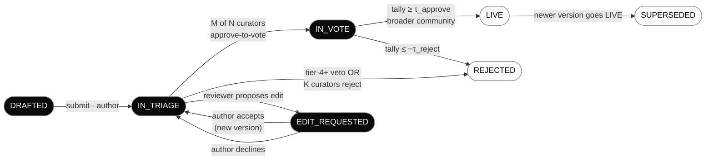

# Contribution governance: triage, voting, comments, edit requests

How a piece of content moves from "someone submitted it" to "the network's LLM is using it to answer questions." Today this is a single-step pending→approved/rejected vote. The user-facing vision is richer: a triage stage with reviewer discussion and edit requests, then a community voting stage, then accessibility to the agent. This doc lays out the target lifecycle, the missing data model + UX, and what to land first.

## The current state (June 2026)

What's wired up:

| Stage | What exists |
| --- | --- |
| Submit | `POST /v1/contributions` + `/app/contribute/new` form. Body + citations + primary category. |
| Triage | **Does not exist** — submissions go straight to voting. |
| Comments | **Does not exist** — no model, no API, no UI. |
| Edit requests | **Does not exist** — versioning happens only via "submit a new version of the same lineage", which auto-supersedes. No PR-style line diffs. |
| Voting | `castVote(+1 / 0 / -1)` weighted by tier. Single `/app/review` list. |
| Status | `pending → approved | rejected | superseded`. Threshold-based. |
| Lineage view | Read-only timeline at `/app/explore/lineages/$id`. Versions + tallies, no diffs, no comments. |
| Public feed | `/app/explore/contributions` exists but is a filter-table, not a feed. No activity stream. |

What the user wants on top of that:

1. **Triage stage between submit and vote.** Reviewers read, comment, request edits, approve-to-vote OR reject. The community vote only happens on triage-passed content.
2. **Comments tracking** — threaded discussion attached to a contribution (and possibly to a specific line).
3. **"PR"-style line diff edit requests** — a reviewer proposes a textual change; the original contributor accepts/rejects; the accepted version becomes a new lineage entry without losing attribution to either party.
4. **Public feeds of activity** — visible-by-default streams of what's being submitted, triaged, voted on, accepted.
5. **Revision history with diffs** — see what changed between v1 and v2 of a contribution, and *who* changed what.
6. **Voting pools** — clear "this is up for vote right now" surface, with what each contributor's vote weight is, what counts, when it closes.

## Target lifecycle



Status machine:

| From | Event | To |
| --- | --- | --- |
| `DRAFTED` | submit | `IN_TRIAGE` |
| `IN_TRIAGE` | M of N curators approve-to-vote | `IN_VOTE` |
| `IN_TRIAGE` | any tier-4+ veto OR K curators reject | `REJECTED` |
| `IN_TRIAGE` | reviewer proposes edit | `EDIT_REQUESTED` |
| `EDIT_REQUESTED` | author accepts | new version, `IN_TRIAGE` (parent → `SUPERSEDED`) |
| `EDIT_REQUESTED` | author declines | `IN_TRIAGE` |
| `IN_VOTE` | tally ≥ approve_threshold | `LIVE` |
| `IN_VOTE` | tally ≤ reject_threshold | `REJECTED` |
| `LIVE` | newer version goes LIVE on same lineage | `SUPERSEDED` |

The agent's retrieval only sees `LIVE` content. Everything else is part of the governance fabric but invisible to user-facing chat.

## Data model — what's new

Three new entities, all signed (so the proof chain is preserved):

### `TriageVerdict`
A reviewer's pass/block decision on an in-triage contribution.

```python
@dataclass(frozen=True, slots=True)
class TriageVerdict:
    verdict_id: str          # dq:tv:<hash>
    contribution_id: str
    reviewer_id: str         # must be tier ≥ SOCIAL_PROOF
    decision: Literal["approve_to_vote", "reject", "abstain"]
    rationale: str           # required for reject; optional for approve
    created_at: int
    signature: Signature     # over (contribution_id, reviewer_id, decision, rationale)
```

Threshold rules:
- `approve_to_vote`: ≥ 2 distinct reviewers approve, no active reject from a curator.
- `reject`: any curator reject OR 3 distinct reviewer rejects.

### `Comment`
Threaded discussion on a contribution. Can be free-text or anchored to a line range for line-level review.

```python
@dataclass(frozen=True, slots=True)
class Comment:
    comment_id: str          # dq:c:<hash>
    contribution_id: str
    parent_comment_id: str | None   # for threading
    author_id: str
    body: str                # markdown
    line_anchor: tuple[int, int] | None  # (start_line, end_line) into contribution text
    created_at: int
    signature: Signature     # over (contribution_id, parent, author, body, line_anchor)
```

Comments are append-only. Edits = new comments (with a `replaces_comment_id` field if we want strikethrough rendering).

### `EditRequest`
A reviewer's proposed change. Modeled as a textual diff against the current version.

```python
@dataclass(frozen=True, slots=True)
class EditRequest:
    edit_request_id: str     # dq:er:<hash>
    contribution_id: str     # the version this targets
    requester_id: str        # the reviewer
    proposed_text: str       # full text after the edit (we compute diff at view time)
    rationale: str           # explanation of the change
    status: Literal["open", "accepted", "declined", "withdrawn"]
    resulting_contribution_id: str | None  # set when status=accepted
    created_at: int
    signature: Signature
```

When `accepted`, we create a new `Contribution` row with `parent_version` pointing to the targeted version, `text = proposed_text`, and `contributor_id = original author` (attribution stays with the author; the edit-requester gets credit via the EditRequest record itself in the ledger).

## Status field migration

`Contribution.status` today: `pending | approved | rejected | superseded`.
After: `drafted | in_triage | edit_requested | in_vote | live | rejected | superseded`.

Migration:
- `pending` → `in_triage` (or `in_vote` if we want to grandfather existing pending items past triage).
- `approved` → `live`.
- `rejected`, `superseded` unchanged.

Backwards-compatible: keep the old enum values working in the API for one release, then deprecate. The `valid_statuses` field already returned by `/v1/meta` makes clients tolerant.

## UI surfaces — what to build

### 1. Contribution detail page (rewrite)

Current `/app/explore/contributions/$id` is read-only metadata. Target shape — like a GitHub PR page:

```
┌────────────────────────────────────────────────────────────┐
│ ⓘ <category>  ·  IN TRIAGE  ·  v3  ·  by @author  ·  3h ago │
│ ─────────────────────────────────────────────────────────  │
│ <contribution text rendered as markdown>                   │
│                                                            │
│ Sources: [link1] [link2]                                   │
│ ─────────────────────────────────────────────────────────  │
│ Triage status:                                             │
│   ✓ @curator-anna  approve to vote                         │
│   ✓ @curator-bo    approve to vote                         │
│   • @reviewer-carl proposed an edit  →                     │
│ ─────────────────────────────────────────────────────────  │
│ Conversation (5)                                           │
│   @anna 2h ago                                             │
│   > Worth clarifying the corner case for negative          │
│   > integers — currently only ℤ⁺ is covered.               │
│     ↳ @author 1h ago: agreed, see edit request.            │
│   ...                                                      │
│ ─────────────────────────────────────────────────────────  │
│ Revision history                                           │
│   v3 ─── you are here (in triage)                          │
│   v2 ─── superseded, was live for 14 days                  │
│   v1 ─── superseded                                        │
│   [show diff v2 → v3]                                      │
└────────────────────────────────────────────────────────────┘
```

Three new tabs/sections on top of the read-only text: triage, conversation, revision history with diff.

### 2. Triage queue

Replace today's `/app/review` (which is a single voting queue) with `/app/triage` for tier-3+ users:

```
┌────────────────────────────────────────────────────────────┐
│ Triage queue · 12 awaiting  · 3 with my pending review     │
│ Filter:  category ▾  status ▾  oldest first ▾              │
│ ─────────────────────────────────────────────────────────  │
│ <ContributionCard with one-click approve/reject/comment>   │
│   ...                                                      │
└────────────────────────────────────────────────────────────┘
```

Live updates via the existing review-stream SSE (extend it to carry triage events too).

### 3. Voting pool

The current `/app/review` becomes `/app/vote` — and it ONLY shows `IN_VOTE` contributions, not raw submissions. The community sees content that's already passed reviewer triage.

```
┌────────────────────────────────────────────────────────────┐
│ Up for community vote · 47 open  · closes in 2d-5d         │
│ ─────────────────────────────────────────────────────────  │
│ <Card per contribution: text · tally · your vote · close>  │
└────────────────────────────────────────────────────────────┘
```

### 4. Public activity feed

New: `/explore` (no login required) shows the network's pulse — recent submissions, recent approvals, hot voting items, newly live content. Builds external credibility and gives users something to read while the agent is the main draw.

```
┌────────────────────────────────────────────────────────────┐
│ Today on DeQuorum                                          │
│ ─────────────────────────────────────────────────────────  │
│ ● 14 new contributions  ● 9 went live  ● 3 LoRA bake-ins   │
│ ─────────────────────────────────────────────────────────  │
│ HOT IN VOTE                                                │
│   <contribution preview>  +12 tally · 5h left              │
│   ...                                                      │
│ NEWLY LIVE                                                 │
│   <contribution preview>  by @author · 30m ago             │
│   ...                                                      │
└────────────────────────────────────────────────────────────┘
```

### 5. Revision-diff view

Extend `/app/explore/lineages/$id`: clicking between two versions shows a side-by-side or unified textual diff. Reuse a tiny diff library (e.g. `diff` from npm) — no need for a heavy editor.

### 6. Edit-request UI

On a contribution's detail page, a "Suggest an edit" button opens an inline textarea with the current text pre-filled. The reviewer edits, adds a rationale, submits. The author sees a notification + a diff view + accept/decline buttons. Accept → new version + triage starts again.

## Backend endpoints — what to add

Minimum set:

| Endpoint | Purpose |
| --- | --- |
| `POST /v1/contributions/{id}/comments` | Create a comment (free or line-anchored). |
| `GET  /v1/contributions/{id}/comments` | List comments (threaded). |
| `POST /v1/contributions/{id}/triage` | Record a TriageVerdict. |
| `POST /v1/contributions/{id}/edit-requests` | Propose an edit. |
| `POST /v1/edit-requests/{id}/accept` | Author accepts; creates new contribution. |
| `POST /v1/edit-requests/{id}/decline` | Author declines. |
| `GET  /v1/triage/queue` | Things awaiting triage. |
| `GET  /v1/vote/queue` | Things up for community vote (= today's review queue, narrowed). |
| `GET  /v1/feed/recent` | Public activity feed. |

Streaming: extend the existing `/v1/review/stream` SSE into `/v1/governance/stream` that carries all status transitions, votes, and comments. The frontend subscribes once and routes the events.

## Phased delivery — what to land in what order

Each phase is independently shippable and useful. Don't try to land all of this at once.

### Phase 1 — Comments — **LANDED 2026-06-05**

The foundation for everything else. Comments are now wired end-to-end: signed `Comment` model in [src/dequorum/comments/](../../services/app/src/dequorum/comments/), `CommentStore` backed by the `comments` table (Alembic migration `0003_comments`), three REST endpoints (`GET`/`POST /v1/contributions/{id}/comments`, `DELETE /v1/comments/{id}`), and a `CommentThread` UI component on the contribution detail page.

Shipped invariants:

- **Append-only.** No hard deletes. Soft-redact via `redacted_at` + `redacted_by`; the row stays, the body is masked in API responses, threading structure survives.
- **Signed.** Each comment carries an Ed25519 signature over its canonical payload, same model as `Contribution` and `Vote`.
- **Threaded.** `parent_comment_id` self-FK; the client groups by parent and renders one level of visual nesting.
- **Replacement chain.** Posting a new comment with `replaces_comment_id` is the "edit" path — the original row's `replaced_by_comment_id` is updated in the same transaction so the UI can render strikethrough on the predecessor without rewalking the table.
- **Line anchors.** Optional `(start_line, end_line)` field reserved for the diff-view in Phase 3. The data model is in place; UI rendering is deferred.

**Auth note (transient):** A `commenter_for_uid()` helper derives a deterministic Ed25519 keypair from a Firebase uid so any signed-in user can post without first going through the full contributor onboarding (agreement signing, public-key registration). This is a documented dev placeholder — production swaps it for a real key-management lookup. The signature shape and proof chain don't change.

**Tier policy:** today `_is_curator()` returns `False` because no Firebase users are mapped to `Tier.CURATOR`. Redaction is therefore strictly self-redact. When the contributor onboarding flow lands and Firebase uids carry a tier claim, flip this — the moderation code path is wired and tested.

### Phase 2 — Triage stage (2-3 weeks)

Add the `TriageVerdict` model, the status-machine transition (`pending` → `in_triage` → `in_vote`), the `/app/triage` queue page, and the triage events on the stream.

Split today's `/app/review` into `/app/triage` (tier-3+) and `/app/vote` (tier-1+). Backwards-compat: keep `/app/review` as a redirect for a release.

**Why second:** this is the heart of the user's ask. Implements the governance gate. Builds on phase 1's comments for triage rationale.

### Phase 3 — Edit requests (2-3 weeks)

`EditRequest` model + endpoints. Diff view on contribution detail. Inline "suggest edit" UX. Author accept/decline flow.

Tricky bits: attribution math when an edit is accepted (author keeps text-credit; editor gets a "improved this contribution" credit in the ledger), and signature handling when the text changes (re-sign with the same key on accept).

**Why third:** the most complex piece. Wait until comments + triage are landed and the team understands the patterns.

### Phase 4 — Public feed + revision-diff view (1-2 weeks)

The polish layer. `/explore` public feed, side-by-side diff in lineage view, "newly live" / "hot in vote" widgets.

**Why last:** these are growth/marketing surfaces. They depend on the rich underlying state machine being in place. They have the lowest gate-keeping requirement, so building them earlier risks UI churn as the state model settles.

## Migration safety

Each phase ships behind a feature flag in `_config` (`triage_enabled`, `edit_requests_enabled`, etc). Old behavior (single-stage voting) keeps working until the flag flips. Tests cover both states until the flag is retired.

The status enum change is the only schema-affecting move. Use the existing Alembic migration setup; back-fill `pending` rows to `in_triage` and `approved` rows to `live` in the same migration that adds the new enum values.

## What this does NOT need

- **A separate workflow engine.** The status machine is small enough to live in `contribution.py` as a `transition()` method. Don't bring in temporal/airflow/etc.
- **Real-time collaborative editing.** Edit requests are submit-and-review, not Google-Docs-style. Way simpler, plenty for the use case.
- **A separate notification service.** Use the existing SSE stream + a small "unread for me" counter in the UI. Email/push can come later.
- **Per-comment voting / karma.** Comments are discussion, not content; the karma signal is on contributions only.

## Open design questions

The kind of thing worth a decision before phase 2 starts:

1. **Who is a triage reviewer?** Today, anyone with the `reviewer` role votes. For triage we likely want tier ≥ `SOCIAL_PROOF` (tier 2) as the floor and tier ≥ `CURATOR` (tier 4) to wield veto. Codify this in `TIER_VOTE_WEIGHT` or in a new `TIER_TRIAGE_POWER` map.
2. **What's the SLA on triage?** A submission that sits 30 days in triage with no movement — does it auto-expire to `rejected`, auto-promote to `in_vote`, or stay forever? Strong opinion: 14-day SLA with auto-promote-to-vote (don't let inactivity kill a contribution; let the community decide instead of silence).
3. **Anonymous comments?** Tier-0 users can read but not comment, probably. Tier-1+ can comment. Aligns with the existing tier model.
4. **Vote weight on triage vs. final vote.** Curators wield veto in triage but have *less* weight in final vote (their tier weight is 1.0 — see `TIER_VOTE_WEIGHT`). This is by design: curators keep stuff *moving*, the community keeps stuff *correct*. Worth being explicit about this when documenting the system to contributors.
