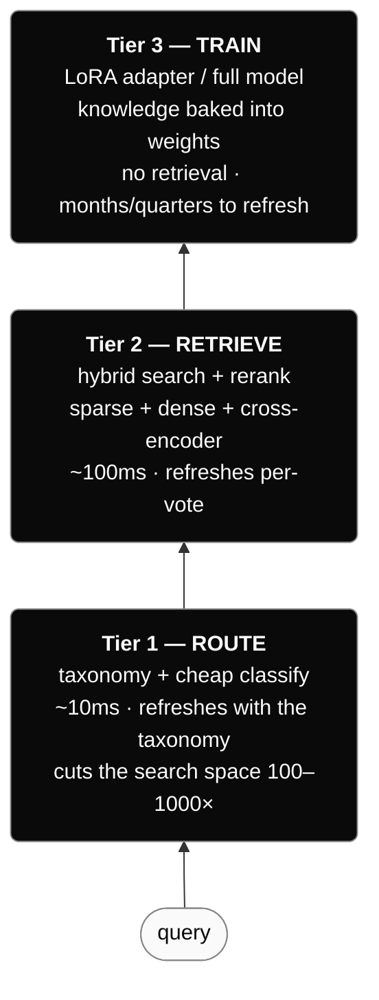

# Retrieval & scaling: layering contributor knowledge on a base LLM

How DeQuorum gets answers out the door — today, at 1k contributions; later, at 1B. The honest version: today's pipeline is fine for the seed phase, but pure dense vector search is not the architecture that wins at scale. This doc lays out the path.

## The core problem

DeQuorum answers questions by giving a base LLM extra context — *contributions* — that the people of the network have voted into existence. Two failure modes to avoid:

1. **Retrieval is the bottleneck.** The user types, then waits 300ms+ before the model even starts generating. Most of that is us doing similarity search and prompt augmentation in a way that doesn't scale.
2. **Retrieval is wrong.** We find passages that *look* topically related but don't actually answer the question — or we miss the passage that does because the embedding hashed it next to something unrelated.

The instinct that "basic vector search isn't really the right choice" is correct, with a nuance: it's the right *first* choice, the wrong *only* choice, and the wrong *long-term* choice.

## Why pure vector search runs out of road

Sentence-embedding ANN is a blunt instrument. It works on a 768-dimensional vibe.

| Failure mode | What it looks like |
| --- | --- |
| **Negation collapse** | "Don't use float for currency" and "use float for currency" land near each other in embedding space. Cosine similarity ≈ 0.9. The model sees the wrong side of the claim. |
| **Specificity flattening** | A deep technical assertion and a beginner question about it look the same. We retrieve a paragraph about advanced edge cases when the asker needed "what is X". |
| **Multi-hop blindness** | Real answers often require composing 2-3 contributions. Top-K nearest neighbors can't do that. The right pair never both make it into the prompt. |
| **Disambiguation failure** | "Python" the snake, "Python" the language. The embedding doesn't know your domain. |
| **No authority signal** | Vector similarity has no notion of "this contributor has tier 4 reputation and 90% approval rate" vs. "this is from a tier 1 with no track record." |
| **Long-tail decay** | At 1B vectors, even good recall@10 means dropping a lot. ANN is logarithmic in query time but lossy in answer correctness. |

The fix isn't a better embedder. It's *layering* — sparse + dense + structured + reranked — so each layer compensates for the failure modes of the one below.

## The three-tier model

Think of DeQuorum's answer path as three concentric tiers, fast to slow, broad to narrow.

### Tier 1 — Route: get to the right neighborhood, fast

The first job is to throw most of the corpus away. At 1k contributions you can search them all; at 1M you cannot afford to.

**Today:** `EmbeddingRouter` picks a single category by query↔persona similarity. `KeywordRouter` falls back. Trivial inputs (small-talk) now skip routing entirely.

**Next:** the taxonomy already exists (`Category` tree, ~30 nodes today, designed for hierarchical expansion). Train a small classifier on `(query, category_id)` pairs as they accumulate. This is a 10ms call that selects 1-3 categories, and we only retrieve within those partitions.

**Long-term:** the taxonomy *is* the index. Contributions are stored partitioned by category. Routing becomes a tree walk: top-level category → sub-category → routable leaf. This makes per-partition retrieval cheap forever, regardless of total corpus size.

### Tier 2 — Retrieve: hybrid + rerank within the partition

Inside the routed partition we do the actual matching. Three sub-stages:

**2a — Sparse (BM25 / SPLADE).** Postgres has `tsvector` built in; this is cheap to add today. Sparse catches exact-keyword matches that dense embeddings miss: entity names, code identifiers, numbers, version strings, names of people. The kind of thing where the user typed the literal token and the contribution has the literal token.

**2b — Dense (vector ANN).** What we have. pgvector inside Postgres. Catches paraphrase, synonymy, conceptual similarity. Stays in Postgres until we hit ~10M vectors / sustained ~100 QPS — then a dedicated store (Qdrant / Vespa / LanceDB) starts pulling its weight on the operational side.

**2c — Rerank (cross-encoder).** Take top-50 from fused-RRF of 2a+2b, run a small cross-encoder (`bge-reranker-v2-m3` or similar, ~100M params) over `(query, passage)` pairs. Output: top-5. This is where actual *relevance* gets enforced, because the cross-encoder reads both texts together and is trained to score "does this passage answer this question."

**2d — Authority filter.** Drop contributions that don't pass: `status != approved`, `version != current`, `tally < threshold`, `contributor.tier < min_tier`. This is a SQL WHERE, not ML.

Reciprocal Rank Fusion (RRF) between sparse and dense is the standard combiner — `score(d) = Σ 1/(k + rank_i(d))`. It's three lines of code and works without tuning.

### Tier 3 — Train: bake the knowledge into the model

This is the long game and what makes DeQuorum *different* from RAG-as-a-feature.

When a domain accumulates enough high-consensus contributions (rule of thumb: ~10k approved facts in a coherent category), the right move is to **fine-tune a LoRA adapter** on those contributions. The adapter encodes the knowledge directly into the model. Retrieval falls back to "fresh contributions added since the last training run" — a much smaller set.

The benefits compound:
- **Faster:** no retrieval round-trip, no prompt augmentation overhead.
- **Better:** the model has the knowledge "in its bones" — multi-hop reasoning, cross-contribution synthesis, paraphrase robustness all improve.
- **Differentiated:** the trained model is the asset DeQuorum builds that competitors can't replicate without the contributor network.
- **Compositional:** stack a "medicine" LoRA + a "legal" LoRA at inference time for cross-domain questions.

The existing `BASE_MODEL_REGISTRY` and `model-swap.md` procedure already support swapping models in. The natural extension: a *LoRA registry* that tracks `(base_model, adapter_path, training_data_hash, approved_contribution_set)` per domain, with the same license-purity discipline.

This is where the "kickbacks to contributors" economic model bites: the LoRA training pipeline knows exactly which contributions ended up in which adapter, which adapters served which queries, and that lineage flows directly to the payout ledger.

## What to land now (next 2-4 weeks)

In priority order, each one buys real perceived speed or relevance:

1. **Hybrid BM25 + dense retrieval.** Add a `tsvector` column + GIN index on contribution text. Implement RRF fusion in `Retriever`. Largest correctness win for least code. *Effort: small. Impact: large.*

2. **Cross-encoder rerank as an optional final stage.** Use `bge-reranker-base` (~30M params, ~50ms on CPU for top-50). Behind a feature flag. *Effort: medium. Impact: medium-large.*

3. **Category-based partition filter.** Even before training a category classifier, restrict retrieval to the same `primary_category_id` as the routed category (a simple SQL filter). Cuts search space, improves relevance. *Effort: trivial. Impact: medium.*

4. **Structured logging of `(query, retrieved_set, final_answer, user_signal)`** — every interaction is training data for the eventual classifier + LoRA. We are *currently throwing this away.* This is the single highest-ROI piece of plumbing in the whole roadmap. *Effort: small. Impact: enormous (deferred).*

5. **Move embedding to a worker.** Right now the API process holds sentence-transformers in memory. Fine for a single box; on a hot horizontal scale it means every replica loads a 90MB model. Move it to a tiny gRPC embedding service (or use a managed embeddings API for the path that doesn't need on-prem). *Effort: medium. Impact: ops, not user-facing.*

## What to plan for (3-12 months)

1. **Taxonomy-aware routing classifier.** Once #4 above has accumulated ~50k `(query, category)` pairs, train a small distilbert-class classifier. Replaces the embedding-similarity router with a millisecond classify. *Prereq: logged data from step 4.*

2. **Dedicated vector store.** When pgvector hits its wall (~10M vectors, sustained traffic), migrate to Qdrant or Vespa. Don't do it before. Postgres pgvector is excellent up to that scale and the operational simplicity is real. *Trigger, not a deadline.*

3. **First LoRA adapter for the busiest category.** Pick the category with the most approved contributions. Train a LoRA on those `(question_like_synthesis, contribution)` pairs. A/B against retrieval-only. *Prereq: ~10k approved contributions in one category.*

4. **Streaming retrieval.** Today retrieval blocks the first token. With async hybrid retrieval, we can stream the model's initial response (which it can produce from base knowledge alone) *while* retrieval runs, and inject grounding mid-stream via tool-use. This is what makes Perplexity feel fast despite doing more work than us. *Effort: large. Impact: large on perceived TTFT.*

5. **Caching layer.** Query → answer cache with semantic dedup (queries that embed within ε get the same cached answer, with attribution). A small Redis-or-equivalent. Roughly 30-50% of real user traffic is repeat questions in any active community. *Effort: small. Impact: medium-large on cost, small on perceived speed.*

6. **Edge inference.** When the LoRAs are good enough that retrieval is rarely needed, the base+LoRA combo can run on a CDN-adjacent GPU. Latency drops from cross-region roundtrip to ~50ms-class. *Far-future, but the architecture above doesn't preclude it.*

## What this does NOT need (yet)

- **A graph database.** The contribution → contributor → category → vote relationships fit Postgres fine. Bring in Neo4j / DGraph only when you're doing graph-traversal-heavy analytics (e.g., "find chains of contributors whose contributions transitively cite each other") that SQL can't express. Defer.
- **A separate "knowledge base."** The contribution store already is one. Wrapping it in a different abstraction just moves complexity around.
- **Embedding model fine-tuning.** Stock `all-MiniLM-L6-v2` or `bge-small-en-v1.5` is fine until cross-encoder rerank stops fixing the retrieval errors. Then revisit.
- **Multi-modal (image/audio contributions).** Adds enormous surface area. Stay text-only until text is *great*.

## Honest comparisons

| Player | What they do for retrieval | What DeQuorum should learn |
| --- | --- | --- |
| Perplexity | Live web search, query rewriting, citation extraction, streaming answer while retrieving | Streaming-while-retrieving (point 4 above) |
| ChatGPT custom GPTs | Vector store over uploaded docs, no rerank, no training | Don't stop at this. They've capped themselves at "RAG-as-feature." |
| Glean | Tiered hybrid (sparse + dense), per-tenant access controls, learning-to-rank from in-product clicks | Tiered hybrid + signal logging — same shape. |
| You.com | Multi-source search + light reranking | Less ambitious than where DeQuorum needs to go. |
| **DeQuorum** | Today: dense + augment. Roadmap: route → hybrid+rerank → adapter-trained | The adapter-trained tier is the moat. Everyone else can't get there because they don't own the contribution pipeline. |

The architectural bet: **the system that wins long-term is the one that *learns* from its contribution corpus, not just retrieves over it.** Retrieval is the way you operate before you've earned the right to train. The roadmap above is how you earn that right while keeping the lights on.
